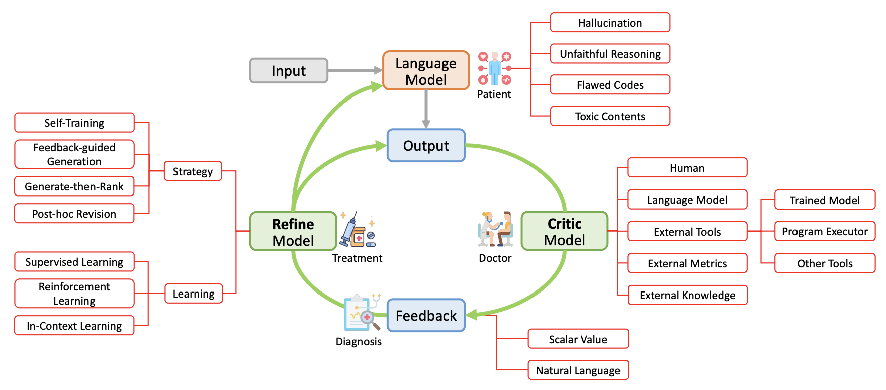

# Self-Correction LLMs Papers

 

This is a collection of research papers for **Self-Correcting Large Language Models with Automated Feedback.**

Our survey paper: [Automatically Correcting Large Language Models: Surveying the landscape of diverse self-correction strategies](https://arxiv.org/abs/2308.03188). Liangming Pan, Michael Saxon, Wenda Xu, Deepak Nathani, Xinyi Wang, William Yang Wang

## [Content](#content)

<table>
<tr><td colspan="2"><a href="#training-time-correction">1. Training-Time Correction</a></td></tr>
<tr>
    <td>&emsp;<a href="#rlhf-strategy">1.1 RLHF Strategy</a></td>
    <td>&ensp;<a href="#fine-tuning-strategy">1.2 Fine-tuning Strategy</a></td>
<tr>
    <td>&emsp;<a href="#self-training-strategy">1.3 Self-Training Strategy</a></td>
    
<tr><td colspan="2"><a href="#generation-time-correction">2. Generation-Time Correction</a></td></tr>
<tr>
    <td>&emsp;<a href="#re-ranking-strategy">2.1 Re-Ranking Strategy</a></td>
    <td>&ensp;<a href="#feedback-guided-strategy">2.2 Feedback-guided Strategy</a></td>
</tr>
<tr><td colspan="2"><a href="#post-hoc-correction">3. Post-hoc Correction</a></td></tr>
<tr>
    <td>&emsp;<a href="#self-refine-strategy">3.1 Self-Refine Strategy</a></td>
    <td>&ensp;<a href="#external-feedback-strategy">3.2 External Feedback Strategy</a></td>

<tr>
    <td>&ensp;<a href="#model-debate-strategy">3.3 Model-Debate Strategy</a></td>
</tr>
</table>

## [Training-Time Correction](#content)

### [RLHF Strategy](#rlhf-strategy)

1. **Training Language Models to Follow Instructions with Human Feedback.** Advances in Neural Information Processing Systems (NeurIPS), 2022. [paper](https://proceedings.neurips.cc/paper_files/paper/2022/file/b1efde53be364a73914f58805a001731-Paper-Conference.pdf)
    
    *Long Ouyang, Jeffrey Wu, Xu Jiang, Diogo Almeida, Carroll L. Wainwright, Pamela Mishkin, Chong Zhang, Sandhini Agarwal, Katarina Slama, Alex Ray, John Schulman, Jacob Hilton, Fraser Kelton, Luke Miller, Maddie Simens, Amanda Askell, Peter Welinder, Paul F. Christiano, Jan Leike, Ryan Lowe* 

2. **Fine-Grained Human Feedback Gives Better Rewards for Language Model Training.** arxiv, 2023. [paper](https://arxiv.org/pdf/2306.01693.pdf)
    
    *Zeqiu Wu, Yushi Hu, Weijia Shi, Nouha Dziri, Alane Suhr, Prithviraj Ammanabrolu, Noah A. Smith, Mari Ostendorf, Hannaneh Hajishirzi* 

3. **Training a Helpful and Harmless Assistant with Reinforcement Learning from Human Feedback.** arxiv, 2022. [paper](https://arxiv.org/pdf/2204.05862.pdf)

    *Yuntao Bai, Andy Jones, Kamal Ndousse, Amanda Askell, Anna Chen, Nova DasSarma, Dawn Drain, Stanislav Fort, Deep Ganguli, Tom Henighan, Nicholas Joseph, Saurav Kadavath, Jackson Kernion, Tom Conerly, Sheer El-Showk, Nelson Elhage, Zac Hatfield-Dodds, Danny Hernandez, Tristan Hume, Scott Johnston, Shauna Kravec, Liane Lovitt, Neel Nanda, Catherine Olsson, Dario Amodei, Tom Brown, Jack Clark, Sam McCandlish, Chris Olah, Ben Mann, Jared Kaplan*

4. **Improving Alignment of Dialogue Agents via Targeted Human Judgments.** arxiv, 2022. [paper](https://arxiv.org/pdf/2209.14375.pdf)
    
    *Amelia Glaese, Nat McAleese, Maja Trębacz, John Aslanides, Vlad Firoiu, Timo Ewalds, Maribeth Rauh, Laura Weidinger, Martin Chadwick, Phoebe Thacker, Lucy Campbell-Gillingham, Jonathan Uesato, Po-Sen Huang, Ramona Comanescu, Fan Yang, Abigail See, Sumanth Dathathri, Rory Greig, Charlie Chen, Doug Fritz, Jaume Sanchez Elias, Richard Green, Soňa Mokrá, Nicholas Fernando, Boxi Wu, Rachel Foley, Susannah Young, Iason Gabriel, William Isaac, John Mellor, Demis Hassabis, Koray Kavukcuoglu, Lisa Anne Hendricks, Geoffrey Irving* 

### [Fine-tuning Strategy](#fine-tuning-strategy)

1. **Training Language Models with Language Feedback at Scale.** arxiv, 2023. [paper](https://arxiv.org/pdf/2303.16755.pdf)
    
    *Jérémy Scheurer, Jon Ander Campos, Tomasz Korbak, Jun Shern Chan, Angelica Chen, Kyunghyun Cho, Ethan Perez* 

2. **Continually Improving Extractive QA via Human Feedback.** arxiv, 2023. [paper](https://arxiv.org/pdf/2305.12473.pdf)
    
    *Ge Gao, Hung-Ting Chen, Yoav Artzi, Eunsol Choi* 

3. **Chain of Hindsight Aligns Language Models with Feedback.** arxiv, 2023. [paper](https://arxiv.org/pdf/2302.02676.pdf)

    *Hao Liu, Carmelo Sferrazza, Pieter Abbeel*

4. **QUARK: Controllable Text Generation with Reinforced Unlearning.** Advances in Neural Information Processing Systems (NeurIPS), 2022. [paper](https://proceedings.neurips.cc/paper_files/paper/2022/file/b125999bde7e80910cbdbd323087df8f-Paper-Conference.pdf)
    
    *Ximing Lu, Sean Welleck, Jack Hessel, Liwei Jiang, Lianhui Qin, Peter West, Prithviraj Ammanabrolu, Yejin Choi* 
 
5. **SimCLS: A Simple Framework for Contrastive Learning of Abstractive Summarization.** Annual Meeting of the Association for Computational Linguistics (ACL), 2021. [paper](https://aclanthology.org/2021.acl-short.135.pdf)

    *Yixin Liu, Pengfei Liu*

6. **BERTTune: Fine-Tuning Neural Machine Translation with BERTScore.** Annual Meeting of the Association for Computational Linguistics (ACL), 2021. [paper](https://arxiv.org/pdf/2106.02208.pdf)

    *Inigo Jauregi Unanue, Jacob Parnell, Massimo Piccardi*

### [Self-Training Strategy](#self-training-strategy)

1. **STaR: Bootstrapping Reasoning With Reasoning.** Advances in Neural Information Processing Systems (NeurIPS), 2022. [paper](https://openreview.net/pdf?id=_3ELRdg2sgI)

   *Eric Zelikman, Yuhuai Wu, Jesse Mu, Noah Goodman*

2. **SELF-INSTRUCT: Aligning Language Models with Self-Generated Instructions.** Annual Meeting of the Association for Computational Linguistics (ACL), 2023. [paper](https://aclanthology.org/2023.acl-long.754.pdf)
    
    *Yizhong Wang, Yeganeh Kordi, Swaroop Mishra, Alisa Liu, Noah A. Smith, Daniel Khashabi, Hannaneh Hajishirzi* 

3. **Constitutional AI: Harmlessness from AI Feedback.** arxiv, 2022. [paper](https://arxiv.org/pdf/2212.08073.pdf)
    
    *Yuntao Bai, Saurav Kadavath, Sandipan Kundu, Amanda Askell, Jackson Kernion, Andy Jones, Anna Chen, Anna Goldie, Azalia Mirhoseini, Cameron McKinnon, Carol Chen, Catherine Olsson, Christopher Olah, Danny Hernandez, Dawn Drain, Deep Ganguli, Dustin Li, Eli Tran-Johnson, Ethan Perez, Jamie Kerr, Jared Mueller, Jeffrey Ladish, Joshua Landau, Kamal Ndousse, Kamile Lukosuite, Liane Lovitt, Michael Sellitto, Nelson Elhage, Nicholas Schiefer, Noemi Mercado, Nova DasSarma, Robert Lasenby, Robin Larson, Sam Ringer, Scott Johnston, Shauna Kravec, Sheer El Showk, Stanislav Fort, Tamera Lanham, Timothy Telleen-Lawton, Tom Conerly, Tom Henighan, Tristan Hume, Samuel R. Bowman, Zac Hatfield-Dodds, Ben Mann, Dario Amodei, Nicholas Joseph, Sam McCandlish, Tom Brown, Jared Kaplan* 

4. **Language Model Self-improvement by Reinforcement Learning Contemplation.** arxiv, 2023. [paper](https://arxiv.org/pdf/2305.14483.pdf)

    *Jing-Cheng Pang, Pengyuan Wang, Kaiyuan Li, Xiong-Hui Chen, Jiacheng Xu, Zongzhang Zhang, Yang Yu*

5. **Large Language Models Can Self-Improve.** arxiv, 2022. [paper](https://arxiv.org/pdf/2210.11610.pdf)
    
    *Jiaxin Huang, Shixiang Shane Gu, Le Hou, Yuexin Wu, Xuezhi Wang, Hongkun Yu, Jiawei Han* 

6. **AlpacaFarm: A Simulation Framework for Methods that Learn from Human Feedback.** arxiv, 2023. [paper](https://arxiv.org/pdf/2305.14387.pdf)
    
    *Yann Dubois, Xuechen Li, Rohan Taori, Tianyi Zhang, Ishaan Gulrajani, Jimmy Ba, Carlos Guestrin, Percy Liang, Tatsunori B. Hashimoto* 

## [Generation-Time Correction](#content)

### [Re-Ranking Strategy](#re-ranking-strategy)

1. **Large Language Models are Better Reasoners with Self-Verification.** arXiv, 2023. [paper](https://arxiv.org/pdf/2212.09561.pdf)
    
    *Yixuan Weng, Minjun Zhu, Fei Xia, Bin Li, Shizhu He, Kang Liu, Jun Zhao* 

2. **CodeT: Code Generation with Generated Tests.**  International Conference on Learning Representations (ICLR), 2023. [paper](https://openreview.net/pdf?id=ktrw68Cmu9c)
    
    *Bei Chen, Fengji Zhang, Anh Nguyen, Daoguang Zan, Zeqi Lin, Jian-Guang Lou, Weizhu Chen* 

3. **LEVER: Learning to Verify Language-to-Code Generation with Execution.** International Conference on Machine Learning (ICML), 2023. [paper](https://arxiv.org/pdf/2302.08468.pdf)
    
    *Ansong Ni, Srini Iyer, Dragomir Radev, Ves Stoyanov, Wen-tau Yih, Sida I. Wang, Xi Victoria Lin* 

4. **Rethinking with Retrieval: Faithful Large Language Model Inference.** arxiv, 2022. [paper](https://arxiv.org/pdf/2301.00303.pdf)

    *Hangfeng He, Hongming Zhang, Dan Roth*

5. **INSTRUCTSCORE: Towards Explainable Text Generation Evaluation with Automatic Feedback.** arxiv, 2023. [paper](https://arxiv.org/pdf/2305.14282.pdf)
    
    *Wenda Xu, Danqing Wang, Liangming Pan, Zhenqiao Song, Markus Freitag, William Yang Wang, Lei Li* 

6. **High Quality Rather than High Model Probability: Minimum Bayes Risk Decoding with Neural Metric.** Transactions of the Association for Computational Linguistics (TACL), 2022. [paper](https://aclanthology.org/2022.tacl-1.47.pdf)
    
    *Markus Freitag, David Grangier, Qijun Tan, Bowen Liang* 

7. **Making Language Models Better Reasoners with Step-Aware Verifier.** Annual Meeting of the Association for Computational Linguistics (ACL), 2023. [paper](https://aclanthology.org/2023.acl-long.291.pdf)
    
    *Yifei Li, Zeqi Lin, Shizhuo Zhang, Qiang Fu, Bei Chen, Jian-Guang Lou, Weizhu Chen* 

### [Feedback-guided Strategy](#feedback-guided-strategy)

1. **Let's Verify Step by Step.** arxiv, 2023. [paper](https://arxiv.org/pdf/2305.20050.pdf)
    
    *Hunter Lightman, Vineet Kosaraju, Yura Burda, Harri Edwards, Bowen Baker, Teddy Lee, Jan Leike, John Schulman, Ilya Sutskever, Karl Cobbe* 

2. **Diffusion-LM Improves Controllable Text Generation.** Advances in Neural Information Processing Systems (NeurIPS), 2022. [paper](https://arxiv.org/pdf/2205.14217.pdf)
    
    *Xiang Lisa Li, John Thickstun, Ishaan Gulrajani, Percy Liang, Tatsunori B. Hashimoto*

3. **FUDGE: Controlled Text Generation With Future Discriminators.** North American Chapter of the Association for Computational Linguistics: Human Language Technologies (NAACL), 2021. [paper](https://aclanthology.org/2021.naacl-main.276.pdf)
   
   *Kevin Yang, Dan Klein*

4. **Entailer: Answering Questions with Faithful and Truthful Chains of Reasoning.**  Conference on Empirical Methods in Natural Language Processing (EMNLP), 2022. [paper](https://aclanthology.org/2022.emnlp-main.134.pdf)
    
    *Oyvind Tafjord, Bhavana Dalvi Mishra, Peter Clark* 
    
5. **Generating Natural Language Proofs with Verifier-Guided Search.** Conference on Empirical Methods in Natural Language Processing (EMNLP), 2022. [paper](https://aclanthology.org/2022.emnlp-main.7.pdf)
    
    *Kaiyu Yang, Jia Deng, Danqi Chen*

6. **Discriminator-Guided Multi-step Reasoning with Language Models.** arxiv, 2023. [paper](https://arxiv.org/pdf/2305.14934.pdf)
    
    *Muhammad Khalifa, Lajanugen Logeswaran, Moontae Lee, Honglak Lee, Lu Wang*
 
7. **Solving Math Word Problems via Cooperative Reasoning Induced Language Models.** Annual Meeting of the Association for Computational Linguistics (ACL), 2023. [paper](https://aclanthology.org/2023.acl-long.245.pdf)
    
    *Xinyu Zhu, Junjie Wang, Lin Zhang, Yuxiang Zhang, Yongfeng Huang, Ruyi Gan, Jiaxing Zhang, Yujiu Yang*

8. **Maieutic Prompting: Logically Consistent Reasoning with Recursive Explanations.** Conference on Empirical Methods in Natural Language Processing (EMNLP), 2022. [paper](https://aclanthology.org/2022.emnlp-main.82.pdf)
    
    *Jaehun Jung, Lianhui Qin, Sean Welleck, Faeze Brahman, Chandra Bhagavatula, Ronan Le Bras, Yejin Choi*

9. **Faithful Reasoning Using Large Language Models.** arxiv, 2022. [paper](https://arxiv.org/pdf/2208.14271.pdf)
    
    *Antonia Creswell, Murray Shanahan*

10. **Reasoning with Language Model is Planning with World Model.** arxiv, 2023. [paper](https://arxiv.org/pdf/2305.14992.pdf)
    
    *Shibo Hao, Yi Gu, Haodi Ma, Joshua Jiahua Hong, Zhen Wang, Daisy Zhe Wang, Zhiting Hu*

11. **Decomposition Enhances Reasoning via Self-Evaluation Guided Decoding.** arxiv, 2023. [paper](https://arxiv.org/pdf/2305.00633.pdf)
    
    *Yuxi Xie, Kenji Kawaguchi, Yiran Zhao, Xu Zhao, Min-Yen Kan, Junxian He, Qizhe Xie*

12. **Tree of Thoughts: Deliberate Problem Solving with Large Language Models.** arxiv, 2023. [paper](https://arxiv.org/pdf/2305.10601.pdf)
    
    *Shunyu Yao, Dian Yu, Jeffrey Zhao, Izhak Shafran, Thomas L. Griffiths, Yuan Cao, Karthik Narasimhan* 

## [Post-hoc Correction](#content)

### [Self-Refine Strategy](#self-refine-strategy)

1. **Self-Refine: Iterative Refinement with Self-Feedback.** arxiv, 2023. [paper](https://arxiv.org/pdf/2303.17651.pdf)

    *Aman Madaan, Niket Tandon, Prakhar Gupta, Skyler Hallinan, Luyu Gao, Sarah Wiegreffe, Uri Alon, Nouha Dziri, Shrimai Prabhumoye, Yiming Yang, Shashank Gupta, Bodhisattwa Prasad Majumder, Katherine Hermann, Sean Welleck, Amir Yazdanbakhsh, Peter Clark*

2. **Self-Verification Improves Few-Shot Clinical Information Extraction.** arxiv,2023. [paper](https://arxiv.org/pdf/2306.00024.pdf)

    *Zelalem Gero, Chandan Singh, Hao Cheng, Tristan Naumann, Michel Galley, Jianfeng Gao, Hoifung Poon*

3. **Reflexion: Language Agents with Verbal Reinforcement Learning.** arxiv, 2023. [paper](https://arxiv.org/pdf/2303.11366.pdf)
   
   *Noah Shinn, Federico Cassano, Beck Labash, Ashwin Gopinath, Karthik Narasimhan, Shunyu Yao*

4. **Iterative Translation Refinement with Large Language Models.** arxiv, 2023. [paper](https://arxiv.org/pdf/2306.03856.pdf)
   
   *Pinzhen Chen, Zhicheng Guo, Barry Haddow, Kenneth Heafield*

5. **Leveraging GPT-4 for Automatic Translation Post-Editing.** arxiv, 2023. [paper](https://arxiv.org/pdf/2305.14878.pdf)
   
   *Vikas Raunak, Amr Sharaf, Hany Hassan Awadallah, Arul Menezes*

6. **Language Models can Solve Computer Tasks.** arxiv, 2023. [paper](https://arxiv.org/pdf/2303.17491.pdf)
   
   *Geunwoo Kim, Pierre Baldi, Stephen McAleer*

7. **SelFee: Iterative Self-Revising LLM Empowered by Self-Feedback Generation.** Blog Post, 2023. [website](https://kaistai.github.io/SelFee/)
   
   *Seonghyeon Ye, Yongrae Jo, Doyoung Kim, Sungdong Kim, Hyeonbin Hwang, Minjoon Seo*

8. **SelfCheckGPT: Zero-Resource Black-Box Hallucination Detection for Generative Large Language Models.** arxiv, 2023. [paper](https://arxiv.org/pdf/2303.08896.pdf)
   
   *Potsawee Manakul, Adian Liusie, Mark J. F. Gales*

### [External Feedback Strategy](#external-feedback-strategy)

1. **Re3: Generating Longer Stories With Recursive Reprompting and Revision.** Conference on Empirical Methods in Natural Language Processing (EMNLP), 2022. [paper](https://aclanthology.org/2022.emnlp-main.296.pdf)

    *Kevin Yang, Yuandong Tian, Nanyun Peng, Dan Klein*

2. **CodeRL: Mastering Code Generation through Pretrained Models and Deep Reinforcement Learning.** Advances in Neural Information Processing Systems (NeurIPS), 2022. [paper](https://arxiv.org/pdf/2207.01780.pdf)

    *Hung Le, Yue Wang, Akhilesh Deepak Gotmare, Silvio Savarese, Steven C.H. Hoi*

3. **REFINER: Reasoning Feedback on Intermediate Representations.** arxiv, 2023. [paper](https://arxiv.org/pdf/2304.01904.pdf)
   
   *Debjit Paul, Mete Ismayilzada, Maxime Peyrard, Beatriz Borges, Antoine Bosselut, Robert West, Boi Faltings*

4. **RL4F: Generating Natural Language Feedback with Reinforcement Learning for Repairing Model Outputs.** Annual Meeting of the Association for Computational Linguistics (ACL), 2023. [paper](https://aclanthology.org/2023.acl-long.427.pdf)
   
   *Afra Feyza Akyurek, Ekin Akyurek, Ashwin Kalyan, Peter Clark, Derry Tanti Wijaya, Niket Tandon*

5. **Learning to Simulate Natural Language Feedback for Interactive Semantic Parsing.** Annual Meeting of the Association for Computational Linguistics (ACL), 2023. [paper](https://aclanthology.org/2023.acl-long.177.pdf)
   
   *Hao Yan, Saurabh Srivastava, Yintao Tai, Sida I. Wang, Wen-tau Yih, Ziyu Yao* 

6. **Baldur: Whole-Proof Generation and Repair with Large Language Models.** arxiv, 2023. [paper](https://arxiv.org/pdf/2303.04910.pdf)
   
   *Emily First, Markus N. Rabe, Talia Ringer, Yuriy Brun* 

7. **CRITIC: Large Language Models Can Self-Correct with Tool-Interactive Critiquing.** arxiv, 2023. [paper](https://arxiv.org/pdf/2305.11738.pdf)
   
   *Zhibin Gou, Zhihong Shao, Yeyun Gong, Yelong Shen, Yujiu Yang, Nan Duan, Weizhu Chen* 

8. **FacTool: Factuality Detection in Generative AI -- A Tool Augmented Framework for Multi-Task and Multi-Domain Scenarios.** arxiv, 2023. [paper](https://arxiv.org/pdf/2307.13528.pdf)
   
   *I-Chun Chern, Steffi Chern, Shiqi Chen, Weizhe Yuan, Kehua Feng, Chunting Zhou, Junxian He, Graham Neubig, Pengfei Liu* 

9. **RARR: Researching and Revising What Language Models Say, Using Language Models.** Annual Meeting of the Association for Computational Linguistics (ACL), 2023. [paper](https://arxiv.org/pdf/2210.08726.pdf)
   
   *Luyu Gao, Zhuyun Dai, Panupong Pasupat, Anthony Chen, Arun Tejasvi Chaganty, Yicheng Fan, Vincent Y. Zhao, Ni Lao, Hongrae Lee, Da-Cheng Juan, Kelvin Guu* 

10. **Check Your Facts and Try Again: Improving Large Language Models with External Knowledge and Automated Feedback.** arxiv, 2023. [paper](https://arxiv.org/pdf/2302.12813.pdf)
   
    *Baolin Peng, Michel Galley, Pengcheng He, Hao Cheng, Yujia Xie, Yu Hu, Qiuyuan Huang, Lars Liden, Zhou Yu, Weizhu Chen, Jianfeng Gao* 

11. **Self-Checker: Plug-and-Play Modules for Fact-Checking with Large Language Models.** arxiv, 2023. [paper](https://arxiv.org/pdf/2305.14623.pdf)
   
    *Miaoran Li, Baolin Peng, Zhu Zhang* 

12. **Improving Language Models via Plug-and-Play Retrieval Feedback.** arxiv, 2023. [paper](https://arxiv.org/pdf/2305.14002.pdf)
   
    *Wenhao Yu, Zhihan Zhang, Zhenwen Liang, Meng Jiang, Ashish Sabharwal* 

13. **Demystifying GPT Self-Repair for Code Generation.** arxiv, 2023. [paper](https://arxiv.org/pdf/2306.09896.pdf)
   
    *Theo X. Olausson, Jeevana Priya Inala, Chenglong Wang, Jianfeng Gao, Armando Solar-Lezama* 

14. **Self-Edit: Fault-Aware Code Editor for Code Generation.** arxiv, 2023. [paper](https://arxiv.org/pdf/2305.04087.pdf)
   
    *Kechi Zhang, Zhuo Li, Jia Li, Ge Li, Zhi Jin* 

15. **Teaching Large Language Models to Self-Debug.** arxiv, 2023. [paper](https://arxiv.org/pdf/2304.05128.pdf)
   
    *Xinyun Chen, Maxwell Lin, Nathanael Schärli, Denny Zhou* 

16. **SelfEvolve: A Code Evolution Framework via Large Language Models.** arxiv, 2023. [paper](https://arxiv.org/pdf/2306.02907.pdf)
   
    *Shuyang Jiang, Yuhao Wang, Yu Wang* 

17. **Logic-LM: Empowering Large Language Models with Symbolic Solvers for Faithful Logical Reasoning.** arxiv, 2023. [paper](https://arxiv.org/pdf/2305.12295.pdf)
   
    *Liangming Pan, Alon Albalak, Xinyi Wang, William Yang Wang* 

18.  **Self-Critiquing Models for Assisting Human Evaluators.** arxiv, 2022. [paper](https://arxiv.org/pdf/2206.05802.pdf)
   
     *William Saunders, Catherine Yeh, Jeff Wu, Steven Bills, Long Ouyang, Jonathan Ward, Jan Leike* 

19. **ALGO: Synthesizing Algorithmic Programs with Generated Oracle Verifiers.** arxiv, 2023. [paper](https://arxiv.org/pdf/2305.14591.pdf)
   
    *Kexun Zhang, Danqing Wang, Jingtao Xia, William Yang Wang, Lei Li* 

20. **A New Era in Software Security: Towards Self-Healing Software via Large Language Models and Formal Verification.** arxiv, 2023. [paper](https://arxiv.org/pdf/2305.14752.pdf)
   
    *Yiannis Charalambous, Norbert Tihanyi, Ridhi Jain, Youcheng Sun, Mohamed Amine Ferrag, Lucas C. Cordeiro* 

21. **Generating Sequences by Learning to Self-Correct.** International Conference on Learning Representations (ICLR), 2023. [paper](https://openreview.net/pdf?id=hH36JeQZDaO)
   
    *Sean Welleck, Ximing Lu, Peter West, Faeze Brahman, Tianxiao Shen, Daniel Khashabi, Yejin Choi* 

22. **MAF: Multi-Aspect Feedback for Improving Reasoning in Large Language Models.** Conference on Empirical Methods in Natural Language Processing (EMNLP), 2023. [paper](https://arxiv.org/abs/2310.12426)

    *Deepak Nathani, David Wang, Liangming Pan, William Yang Wang*

### [Model-Debate Strategy](#model-debate-strategy)

1. **Improving Factuality and Reasoning in Language Models through Multiagent Debate.** arxiv, 2023. [paper](https://arxiv.org/pdf/2305.14325.pdf)
   
   *Yilun Du, Shuang Li, Antonio Torralba, Joshua B. Tenenbaum, Igor Mordatch*

2. **LM vs LM: Detecting Factual Errors via Cross Examination.** arxiv, 2023. [paper](https://arxiv.org/pdf/2305.13281.pdf)
   
   *Roi Cohen, May Hamri, Mor Geva, Amir Globerson*

3.  **Improving Language Model Negotiation with Self-Play and In-Context Learning from AI Feedback.** arxiv, 2023. [paper](https://arxiv.org/pdf/2305.10142.pdf)
   
    *Yao Fu, Hao Peng, Tushar Khot, Mirella Lapata*

4. **PRD: Peer Rank and Discussion Improve Large Language Model-based Evaluations.**  arxiv, 2023. [paper](https://arxiv.org/pdf/2307.02762.pdf)
   
   *Ruosen Li, Teerth Patel, Xinya Du*

## Contribution
### Contributors

<!--

-->

<!-- ALL-CONTRIBUTORS-LIST:START - Do not remove or modify this section -->
<!-- prettier-ignore-start -->
<!-- markdownlint-disable -->
<table>
  <tbody>
    <tr>
      <td align="center" valign="top" width="120px">
          <a href="http://www.liangmingpan.com/">
              
               
              <b>Liangming Pan</b>
          </a>
      </td>
      <td align="center" valign="top" width="120px">
          <a href="https://xinyuanlu00.github.io/">
              
               
              <b>Xinyuan Lu</b>
          </a>
      </td>
    </tr>
  </tbody>
</table>

### Acknowledgement
-  There are cases where we miss important works in this field, please contribute to this repo! Thanks for your efforts in advance.
- If you encounter any problem, please either directly contact [Liangming Pan](liangmingpan@ucsb.edu) or leave an issue in the GitHub repo.
